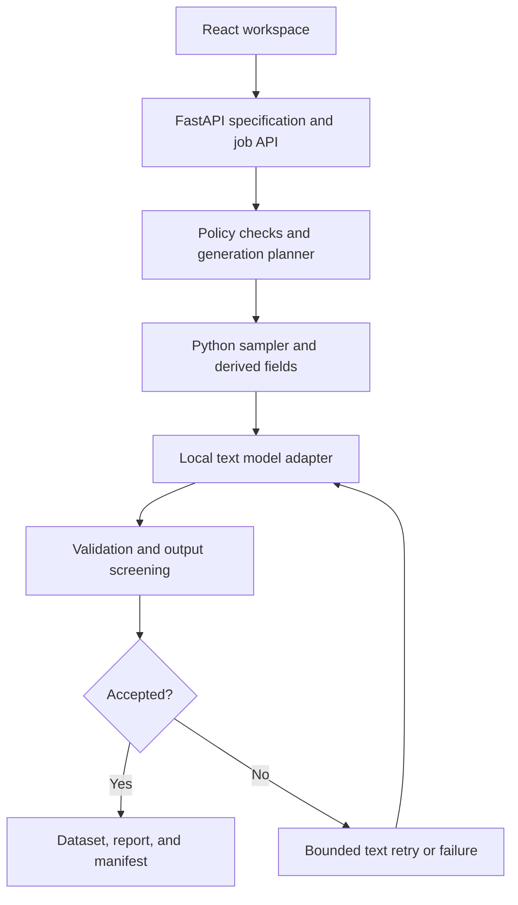

# SynthLab: Architecture

Baseline: 2026-10-06. Status: proposed implementation contract. Record implemented changes here and rationale in DECISIONS.MD.

## Design principles

1. Python controls structured values, probabilities, identifiers, dates, and business rules.
2. The LLM generates approved text fields from already sampled row facts.
3. A validated declarative specification is the source of truth; prompts cannot override it.
4. Validate before sampling, after model output, and again before export.
5. Small local components with explicit contracts; no autonomous tools or agents in the generation path.
6. Bounded resource use, transparent failures, and provenance accompany every job.

## Components and boundaries

Frontend communicates only with FastAPI. The backend owns model configuration; users cannot supply arbitrary endpoint URLs. Model inference receives only sanitized row context. Generation never browses, invokes tools, executes code, or reads arbitrary files. Dependencies and model artifacts may require downloads during setup; runtime local behavior is verified separately.

## Proposed technology stack

| Component | Choice | Implementation note |
| --- | --- | --- |
| UI | React, TypeScript, Vite | Tailwind CSS and shadcn/ui for consistent controls |
| API | FastAPI | Pydantic contracts and structured errors |
| Numeric generation | NumPy, SciPy | Dedicated seeded random generators |
| Dataset processing | pandas | Validate and export bounded in-memory datasets |
| Inference | Ollama initially | Adapter interface allows later compatible local runtimes |
| Screening | Presidio + custom recognizers | Explicit language coverage and artificial fixtures |
| Metadata | SQLite | Specifications, job state, progress, safe error codes |
| Artifacts | Local job directory | Application-generated filenames, isolated job folders |
| Tests | pytest, Playwright | Relevant backend tests and core UI journeys |

Exact compatible versions are selected and locked during P0.2. Do not invent package pins in advance.

## Repository layout

| Path | Responsibility |
| --- | --- |
| frontend/src/ | Pages, components, API client, form state, charts |
| backend/api/ | Routes and request/response schemas |
| backend/specs/ | Specification models, semantic checks, planner |
| backend/generation/ | Sampling, conditional rules, derived fields, model adapter |
| backend/policies/ | Allowed inputs, sensitive recognizers, output policy |
| backend/validation/ | Row checks, dataset checks, evaluation report |
| backend/jobs/ | Worker, state machine, persistence, cancellation |
| backend/export/ | CSV/JSON writers, safe spreadsheet mode, manifests |
| tests/ | Unit, integration, and workflow checks |
| evals/ | Frozen scenarios, benchmark runners, labelled artificial fixtures |
| examples/ | Specifications and small fictional sample outputs |
| docs/ | Supporting architecture, threat model, screenshots, dataset card |

Keep the seven context documents at repository root. Create runtime artifact/cache paths in .gitignore before producing data or downloading weights.

## Dataset specification v1

Use versioned JSON and Pydantic models with unknown keys rejected. Initial envelope:

| Key | Contract |
| --- | --- |
| spec_version | Literal supported version, initially 1 |
| name | Bounded display label, not a filesystem path |
| row_count | Positive integer; preview/full job limits applied separately |
| seed | Bounded non-negative integer |
| generation_mode | random or fixed_proportions |
| fields | Ordered list of unique field names, types, generator settings |
| constraints | List of allow-listed declarative rules |
| text_options | Prompt template version, bounded text length; no user endpoint/code |

Each field has name, type, nullable, generator, and optional description. Generator variants use a discriminator such as kind. Implement one variant at a time:

- identifier: prefix and deterministic row index; uniqueness enforced.
- categorical: values and probabilities, each finite and non-negative; sum must be 1 within a documented numerical tolerance.
- uniform: min/max, compatible with integer or decimal type.
- truncated_normal: underlying mean/std and lower/upper bounds. Report the actual truncated distribution, not the untruncated mean.
- boolean: probability_true.
- datetime: UTC start/end; explicit inclusion/rounding convention.
- conditional_categorical: depends_on, exhaustive category-to-probability mappings.
- derived_datetime: creation field, status field, resolved status, bounded positive duration.
- llm_text: depends_on list and approved template identifier.

Implement money using integer minor units internally where possible, then format to specified decimal precision. Final rounded values must still meet bounds. Define null probabilities explicitly if supported; do not introduce implicit missingness.

Constraints initially include one_of, greater_than, date_after, unique, and nullable_when with documented null semantics. Constraints have typed field references and operands. No Python expressions, eval, SQL snippets, user regex execution, executable templates, or generated validators.

Preflight rejects unknown generators, duplicate names, invalid types, non-finite numbers, missing references, dependency cycles, invalid probability sums, impossible unique counts, inverted ranges, unsupported fixed-proportion combinations, and contradictions that the supported planner can establish. Arbitrary constraint satisfiability is not an MVP promise.

## Dependency planning and generation

Construct a directed dependency graph and topologically sort it. Ensure text fields cannot alter structured upstream fields. Sample row skeletons, generate derived fields, validate them, and then enrich approved text fields.

Random mode uses seeded categorical draws. Fixed proportions uses largest-remainder allocation: floor N*p for each category, distribute remaining rows by descending fractional remainder with documented stable tie-breaks, then seed-shuffle assignments. Conditional fixed proportions apply within realized parent groups; global child proportions are therefore implied, not separately guaranteed. Document and reject conflicting simultaneous targets.

Use per-field/per-job random streams with stable derivation rather than Python's process-dependent hash. Retries of text must not advance structured sampling streams. Validate uniqueness before model calls. In the MVP, hard structured rules should be satisfied constructively; do not hide large rejection loops behind arbitrary constraints.

When screening rejects text, regenerate text for that same row skeleton. If two retries after the initial attempt fail, fail the job explicitly. Never replace a payment row with a delivery row to improve acceptance. Calculate final quality reports on accepted final records, not only preliminary skeletons.

## Model adapter

Interface responsibilities: health/version check, generation from approved facts, timeout, bounded token budget, structured response parsing, cancellation cooperation, and safe error classification. Provide a deterministic fake adapter for tests and a template adapter for offline baseline generation.

LLM output contains only allowed text-field keys. Request a JSON schema, then independently parse/validate it. A syntactically valid message can still contradict row facts or contain sensitive content. Disable thinking where supported for routine generation; handle runtime output formats explicitly rather than treating reasoning text as a user message.

Recommended candidates are provisional: Qwen3.5-4B, Qwen3.5-9B, and Qwen3-4B-Instruct-2507. See RESEARCH.MD. No default is final until runtime compatibility and task-specific measurements are recorded.

## API contract outline

| Endpoint | Purpose |
| --- | --- |
| GET /api/health | Backend, storage, and local inference status without secrets |
| GET /api/templates | Approved template metadata/specifications |
| POST /api/specs/validate | Return valid flag and field/rule-specific diagnostics |
| POST /api/specs | Save validated specification |
| GET /api/specs/{id} | Retrieve stored specification |
| POST /api/jobs | Submit preview or full generation from a specification snapshot |
| GET /api/jobs/{id} | Status, progress, safe errors, output availability |
| POST /api/jobs/{id}/cancel | Idempotent cancellation request |
| GET /api/jobs/{id}/preview | Bounded accepted preview rows |
| GET /api/jobs/{id}/report | Dataset checks, screening counts, distributions |
| GET /api/jobs/{id}/exports/{format} | Approved completed artifact download |

Use an opaque server-generated UUID for job IDs and allow-list export formats. Never map request filenames or paths directly to disk. Validation errors contain stable code, field/rule path, and readable message. Long work must not occupy a request handler until completion. Polling is sufficient for the MVP; SSE is deferred unless evidence justifies it.

## Job lifecycle and persistence

queued -> running -> completed; running can instead become failed or cancelling -> cancelled. Repeated cancel is safe; cancelling a completed job returns its terminal state. Persist cancellation flags; check between batches and model calls. On restart, mark interrupted running/cancelling jobs failed with an interruption reason. Automatic resume is deferred.

Begin with one worker and one active job, plus a bounded queue. SQLite stores specification snapshots, status, progress, timestamps, safe errors, and artifact metadata. Avoid launching duplicate workers under development reload. Record worker policy in the implementation decision when selected.

Only completed jobs expose normal exports. Partial failed/cancelled artifacts remain unavailable through the normal export route and are cleaned under a documented retention policy. Atomic completion requires validated dataset, report, and manifest written successfully. Do not mark completed before artifacts exist.

## Validation and reporting

Separate: specification validation, row validation, dataset validation, text screening, and benchmark-only human semantic review. Report requested count, accepted count, attempted text calls, rejected attempts, retries, hard-rule failures, duplicates, category counts, numeric summaries, and screening rule identifiers.

Numeric checks compare against the configured bounded/rounded distribution. Repeated-seed evaluations quantify sampling uncertainty. Do not fail every correct random draw simply because it differs from target proportions. Add a stratified manual review worksheet for category/status agreement. Optional classifier/LLM judges are supplementary and never a formal privacy guarantee.

## Export and provenance

CSV and JSON exports contain accepted rows and consistent column ordering. Include report.json and manifest.json as companion artifacts. Manifest includes specification snapshot/hash, seed, requested/accepted counts, timestamp, code revision when available, dependencies, model revision, quantization, prompt version, settings, and measured hardware details where supplied.

Synthetic labels belong in manifest and dataset documentation. Spreadsheet-safe CSV neutralizes formula-triggering cells and documents any transformations; JSON preserves source strings. Pinning seed/version can reproduce structured generation; exact LLM text across devices is not guaranteed. A manifest with unconfirmed revision must say unknown rather than fabricate a hash.

## Security and privacy boundaries

- Bind local services to loopback by default; allow only configured frontend origins.
- Backend chooses model endpoint from trusted configuration. No arbitrary URL fetches or real-data connectors.
- Limit request size, fields, rows, queue depth, context, tokens, timeouts, and retries.
- Screen prompt/description text and reject identity/contact/credential fields under MVP product policy.
- Accept configuration JSON only; reject row datasets and executable content.
- Screen generated text using Presidio plus custom recognizers, including CNIC-like and Pakistani phone patterns; validate pattern coverage with artificial fixtures.
- Do not log raw prompts, generated rows, credentials, model responses, or sensitive rejection snippets.
- Escape UI text; safely serialize CSV/JSON; isolate job paths; no shell/eval/model tools.
- No cloud fallback. Verify telemetry and runtime egress after setup before claiming offline operation.

Local execution and screening reduce specific risks. They do not guarantee a model never reproduces memorized information or every identifier is detectable. Authentication/multi-tenancy requires a separate architecture decision before public hosting.
