# SynthLab

SynthLab is a local-first synthetic data studio for creating fictional, schema-driven datasets. A Python generation engine owns identifiers, categories, probabilities, numbers, dates, dependencies, and validation. A local Ollama model can assist with schema drafting and optional text enrichment, but it cannot overwrite structured row facts.

The application combines a FastAPI backend, a React and TypeScript workspace, SQLite job metadata, and CSV/JSON export with quality and provenance reports.

> SynthLab is designed for fictional data. It does not accept real row datasets and should not be used to reproduce identifiable people, private records, credentials, or financial-account data.

## What it provides

- A versioned Pydantic dataset specification with strict generator/type compatibility.
- Deterministic structured generation using seeded NumPy and SciPy samplers.
- Random and fixed-proportion categorical generation.
- Conditional categories, derived datetimes, nullability, uniqueness, and declarative constraints.
- An AI Schema Builder that converts a short use-case description into a bounded field draft and compiles it into a strict specification in Python.
- Optional local text enrichment through Ollama, with a local template fallback.
- Background jobs with SQLite state, cancellation checkpoints, previews, reports, and manifests.
- Spreadsheet-safe CSV and JSON exports.
- Prompt, schema, and generated-text screening for prohibited fields and sensitive formats.

## Architecture

```mermaid
flowchart LR
    UI[React workspace] --> API[FastAPI API]
    API --> POLICY[Prompt and schema policy]
    POLICY --> SPEC[Pydantic specification]
    SPEC --> ENGINE[Python generation engine]
    ENGINE --> TEXT[Template or local Ollama text adapter]
    TEXT --> SCREEN[Output screening and validation]
    SCREEN --> JOBS[SQLite jobs and artifacts]
    JOBS --> EXPORT[CSV, JSON, report, manifest]
```



The model boundary is intentionally narrow:

1. The Schema Builder screens the request before calling Ollama.
2. Ollama returns a bounded field-intent draft rather than executable code or a complete arbitrary configuration.
3. Python maps that draft to allow-listed field and generator types.
4. The compiled specification is screened and semantically validated again.
5. Job submission repeats the specification policy so the frontend cannot bypass it.
6. During row generation, the model may populate approved text fields only; structured facts remain fixed.

## Requirements

- Python 3.10 or newer
- Node.js and npm (tested with Node.js 24)
- Ollama for AI schema generation and model-backed text enrichment

Structured generation can use the built-in template adapter without Ollama. The AI Schema Builder itself requires the configured Ollama service and model.

## Quick start

### 1. Install the backend

```powershell
python -m venv .venv
.\.venv\Scripts\Activate.ps1
python -m pip install -r requirements.txt
```

Install the default model if it is not already available:

```powershell
ollama pull qwen2.5:7b
```

If Ollama is not already running as a Windows service, start it in a separate terminal:

```powershell
ollama serve
```

Start the API from the repository root:

```powershell
python -m uvicorn backend.main:app --host 127.0.0.1 --port 8000
```

The API is available at `http://127.0.0.1:8000`; interactive API documentation is available at `http://127.0.0.1:8000/docs`.

If the current Windows Python event-loop policy produces a socket error, use the selector-loop launch command:

```powershell
python -c "import asyncio; asyncio.set_event_loop_policy(asyncio.WindowsSelectorEventLoopPolicy()); import uvicorn; uvicorn.run('backend.main:app', host='127.0.0.1', port=8000, loop='none')"
```

### 2. Install and start the frontend

In another terminal:

```powershell
Set-Location frontend
npm ci
npm run dev
```

Open `http://127.0.0.1:5173`.

### 3. Generate a dataset

1. Select the approved support-ticket template or describe a fictional operational dataset in the AI Schema Builder.
2. Review the generated fields and live validation result.
3. Generate a bounded preview before starting a full job.
4. Inspect the quality report and provenance manifest.
5. Download the completed CSV or JSON artifact.

A safe Schema Builder request looks like:

```text
Create 500 fictional warehouse inventory records with synthetic item IDs,
stock category, quantity, unit price, availability, and created timestamp.
```

Requests for real-source records, identity/contact fields, credentials, financial-account data, or guardrail bypasses are rejected before model inference.

## Configuration

SynthLab reads configuration from environment variables. `.env.example` documents the available names and safe local defaults.

| Variable | Default | Purpose |
| --- | --- | --- |
| `SYNTHLAB_OLLAMA_BASE_URL` | `http://127.0.0.1:11434` | Trusted backend Ollama endpoint |
| `SYNTHLAB_DEFAULT_MODEL` | `qwen2.5:7b` | Local model used for schema and text generation |
| `SYNTHLAB_SCHEMA_GENERATION_TIMEOUT_SECONDS` | `90` | Schema Builder request timeout |
| `SYNTHLAB_DB_PATH` | `backend/data/synthlab.db` | SQLite job database |
| `SYNTHLAB_ARTIFACTS_DIR` | `backend/data/artifacts` | Generated job artifacts |

For example, to select another installed model in PowerShell:

```powershell
$env:SYNTHLAB_DEFAULT_MODEL = "qwen2.5-coder:7b"
```

Model endpoints are backend configuration. They are not accepted from browser requests.

## Supported specification features

| Field or rule | Supported behavior |
| --- | --- |
| Identifier | Deterministic prefix, index, padding, and uniqueness checks |
| Category | Weighted random sampling or exact fixed-proportion allocation |
| Conditional category | Distribution selected from a parent category |
| Integer and decimal | Uniform or truncated-normal bounded sampling |
| Boolean | Configurable true probability |
| Datetime | UTC bounded sampling |
| Derived datetime | Status-aware timestamp derived from existing fields |
| Text | Template or local-model enrichment from approved row facts |
| Constraints | Allow-listed declarative rules; no `eval` or executable validators |

## API overview

| Endpoint | Purpose |
| --- | --- |
| `GET /api/health` | Storage and local inference health |
| `GET /api/templates` | Available approved templates |
| `GET /api/templates/{id}` | Complete template specification |
| `POST /api/specs/generate` | Generate and validate a schema through local Ollama |
| `POST /api/specs/validate` | Validate a specification and return diagnostics |
| `POST /api/jobs` | Submit preview or full generation |
| `GET /api/jobs/{id}` | Read job status and progress |
| `POST /api/jobs/{id}/cancel` | Request cancellation |
| `GET /api/jobs/{id}/preview` | Read the bounded completed preview |
| `GET /api/jobs/{id}/report` | Read validation and quality results |
| `GET /api/jobs/{id}/manifest` | Read generation provenance |
| `GET /api/jobs/{id}/exports/{format}` | Download `csv` or `json` output |

## Safety and privacy boundaries

SynthLab applies deterministic policy checks in addition to model instructions:

- Prompt screening occurs before the Schema Builder calls Ollama.
- Generated and manually edited specifications are screened before use.
- Job submission repeats the same schema policy.
- Text output is screened for CNIC-like values, phone numbers, email addresses, payment-card formats, and other configured patterns.
- Text retries preserve the original structured row skeleton.
- CSV export neutralizes spreadsheet formula prefixes.
- Services bind to loopback by default, and there is no cloud-model fallback.

These controls reduce specific risks; they do not establish anonymity, differential privacy, legal compliance, or universal detection of sensitive information. Pattern-based screening can miss novel obfuscations and can conservatively reject harmless wording. Generated text may vary between model versions and devices.

## Verification

Run the complete backend test suite and production frontend build:

```powershell
powershell -ExecutionPolicy Bypass -File scripts\check.ps1
```

Or run the components independently:

```powershell
.\.venv\Scripts\python.exe -m pytest -q tests

Set-Location frontend
npm run build
```

Automated tests avoid requiring live model output by using fake or template adapters. Real Ollama checks should be treated as explicit local integration tests because model output and runtime performance are probabilistic.

## Repository layout

```text
backend/
  api/          FastAPI routes
  specs/        Dataset contracts, templates, AI draft compiler, validation
  generation/   Samplers, generation engine, and text adapters
  policies/     Prompt, schema, and generated-text screening
  validation/   Dataset checks and quality summaries
  jobs/         SQLite state and job orchestration
  export/       CSV, JSON, report, and manifest writers
frontend/       React, TypeScript, and Vite workspace
tests/          Unit and API integration tests
evals/          Reproducible evaluation runners
examples/       Example specifications
scripts/        Project verification commands
```

Generated databases, job artifacts, model files, frontend builds, local agent tooling, and evaluation results are intentionally excluded from version control.
